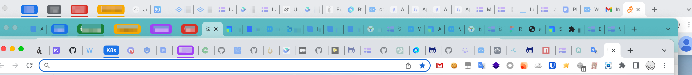
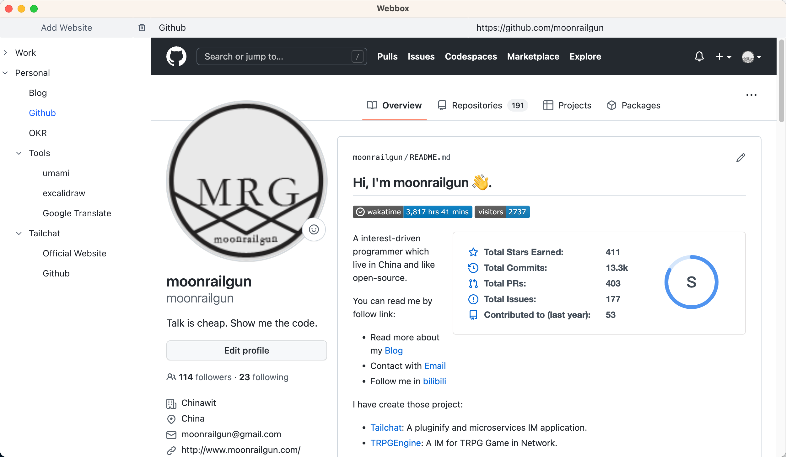

# Webbox

> Organize your favorite websites

[简体中文](./README.zh.md)

`Bookmarks` + `Tabs` + `Tree Organize`

## Motivation

As web applications become more and more developed, there are various tabs in my work. Resident and temporary tabs are mixed together, and web pages with different needs are intertwined.

Taking me personally as an example, I personally often need 3 to 5 personal websites, and work-related websites, including design drafts, various online documents, project management, application publishing, code management, etc., need 5 to 10 tabs.

And more and more temporary tabs, so my current routine is to open three different browser windows, each creating 20-30 different tabs.

Managing tabs has become a rigid requirement with the increasing reliance on online tools. The tab management method of conventional browsers can no longer meet the more complex tab management mode.

## Feature

- Organize your web pages with a hierarchical tree! Simply drag and drop to categorize your pages
- Clean up uncommonly used pages in time to reduce unnecessary memory usage! Many times all you need is an entry that can be found later
- Split your browser space, split long-term and temporary through'webbox ',
- Record your organization and expansion mode to ensure that you can get back to work as soon as possible every time. No need for the browser to remember the last open state - more and more tabs will only make it difficult for your browser to move forward

It's time to return to a refreshing state!

## Try it Now!

No need to compile, download now!

In [here](https://github.com/msgbyte/webbox/releases) can directly obtain the pre-compiled executable file.
