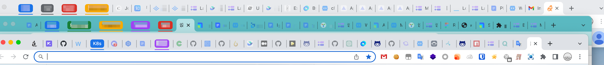
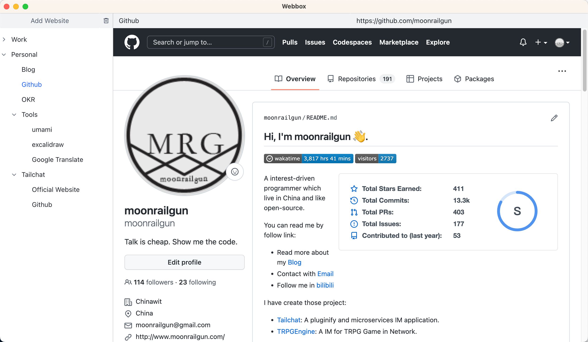

# Webbox

> 组织你的常用网站

## 动机

随着web应用的越来越发达，在我的工作中充斥着各种各样的标签页。常驻的与临时的标签页混杂在一起，不同需求的网页交织在一起。

以我个人为例，我个人常需要3~5个个人网站，工作相关的网站，包括设计稿、各种在线文档、项目管理、应用发布、代码管理等需要常开5~10个标签页。

以及更多更多临时的标签页，让我目前常规的常规现状是开启三个不同的浏览器窗口，每个窗口都创建着20~30个不等的标签页。

管理标签页随着对在线工具愈发的依赖变成了一个刚需的要求。而常规浏览器的标签页管理方式已经无法满足更加复杂的标签页管理模式了。

## 特性

- 通过层级树来组织你的网页! 将你的页面分门别类，简单拖动就可以
- 及时清理不常用的页面，减少不必要的内存占用！很多时候你需要的仅仅是一个后续能找到的入口
- 分割你的浏览器空间，通过 `webbox` 将长久的和临时的分割，
- 记录你的组织与展开模式，确保每一次都能最快回到工作状态。不再需要浏览器记忆上一次的打开状态 —— 越来越多的标签页只会让你的浏览器难以前行

是时候回归清爽的状态了！

## 立即使用

无需编译，立即下载!

在[这里](https://github.com/msgbyte/webbox/releases)可以直接获得已经预编译好的可执行文件.
